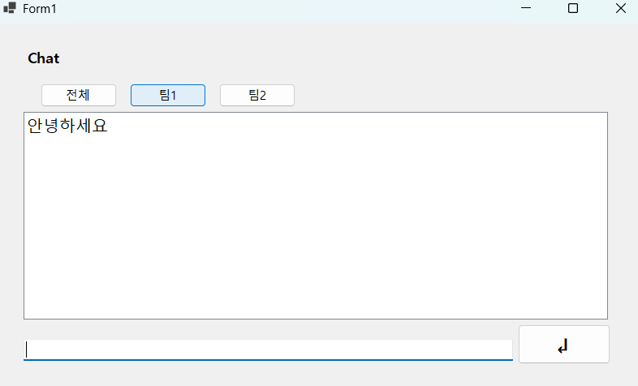
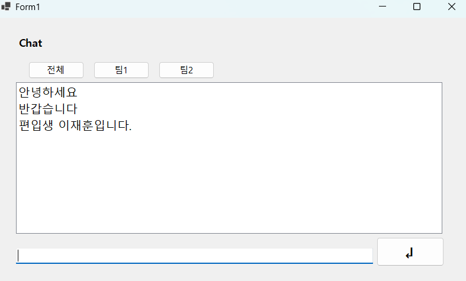

# (C# 코딩) 에코 메신저
## 개요
- C# 프로그래밍 학습
- 핵심기능: TextBox에 입력한 문자들이 전송 버튼을 눌렀을 때 ListBox에 그대로 출력이 되게 함
- 화면구성: TextBox를 하단에 배치 ListBox를 중앙에 배치 전송 버튼을 TextBox우측에 배치 
- 
## 실행 화면
- 1단계 코드의 실행 스크린샷

- 2단계 코드의 실행 스크린샷

- 3단계 코드의 실행 스크린샷
(여기에 이미지 삽입) 

- 4단계 코드의 실행 스크린샷
(여기에 이미지 삽입)

## 배운 내용
- 과제2의 전송 버튼을 엔터 키로 대체 하려는 코딩에 버그가 발생하였을 때는 코파일럿의 도움을 받았습니다.

# (C# 코딩) 에코 메신저
## 개요
- C# 프로그래밍 학습
- 1줄 소개: 사용자 키보드 입력을 받아서 처리하는 프로그램
- 사용한 플랫폼:
- C#, .NET Windows Forms, Visual Studio, GitHub
- 사용한 컨트롤:
- Label, TextBox, ListBox, Button
- 사용한 기술과 구현한 기능:
- Visual Studio를 이용하여 UI 디자인
- string 클래스를 이용한 사용자 입력 데이터 처리
- DateTime 클래스를 이용한 현재시간 정보 구하기
- 수업 중에 배우고 사용했던 클래스들 관련된 설명
-
-
- 실습 중에 구현한 기능들 설명
- 
## 실행 화면 (과제1)
- 과제1 코드의 실행 스크린샷

- 과제 내용
- Label, TextBox, Button, ListBox를 게임창과 유사하게 배치
- TextBox에 타이핑 후 전송 버튼 누르면 ListBox에 출력 됨

## 실행 화면 (과제2)
- 과제2 코드의 실행 스크린샷
- 

- 과제 내용
- UI/UX의 편의성을 개선 
- 1. 입력창에 입력 포커스를 갖다 놓기
- 2. 엔터키를 눌러 마우스 클릭 대신 메시지가 전송되도록 함
- 3. 내용이 없는 빈 문자열이나 공백만 있을 때 메시지가 전송되지 않게 함

## 실행 화면 (과제3)
미완

## 실행 화면 (과제4)
- 과제4 코드의 실행 스크린샷

- 과제 내용
- Label(표시), TextBox(입력), Button(전송), ListBox(대화창)를 적절히 배치합니다.- 전송 버튼 클릭 시 TextBox의 텍스트를 ListBox의 항목(Items)으로 추가합니다.
- 추가 직후 TextBox의 내용을 비워(Clear) 다음 입력을 준비합니다.
- 구현 내용과 기능 설명
- 입력창에 메시지 입력하고 전송 버튼을 누르면 메시지가 리스트 박스에 표시된다.
- 계속 반복하면 메시지가 리스트 박스에 한 줄씩 계속 추가된다.
- 추가 내용이 많아지면 리스트 박스에 스크롤바가 자동으로 생기고 스크롤된다.